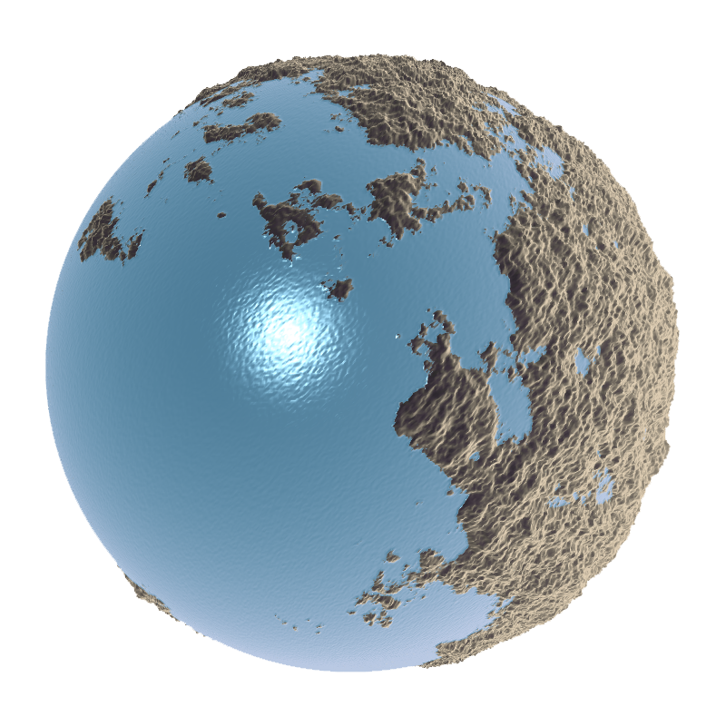

# What is this?

I came up with this algorithm one day on my way home from work. Not knowing whether it'd work, I felt that I had to try and implement it to see its effect. I really liked the results, so I wrote a short paper on it in case anyone wants to implement it or build upon it further. 🤓 There's also a demo included, written in JavaScript/WebGL!

### [Click here to read the paper.](https://www.philiparvidsson.com/s/procedural-landscape-generation-on-sphere-surfaces.pdf)

## Running the demo
1. Clone this repository: `git clone https://github.com/philiparvidsson/Procedural-Landscape-Generation-on-Sphere-Surfaces.git`
2. Navigate to the demo directory and run index.html.

Your browser should display a sphere in 3D.  The sphere mesh is very high-resolution so give it a few minutes to complete (the sphere will stop morphing when it's done).

### [Click here to run the demo.](http://philiparvidsson.com/demos/procedural-landscape-generation-on-sphere-surfaces/index.html)

## Video
Here's a video of the algorithm being applied to a low-resolution mesh in real-time:

